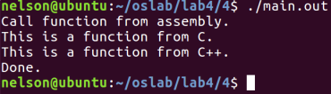
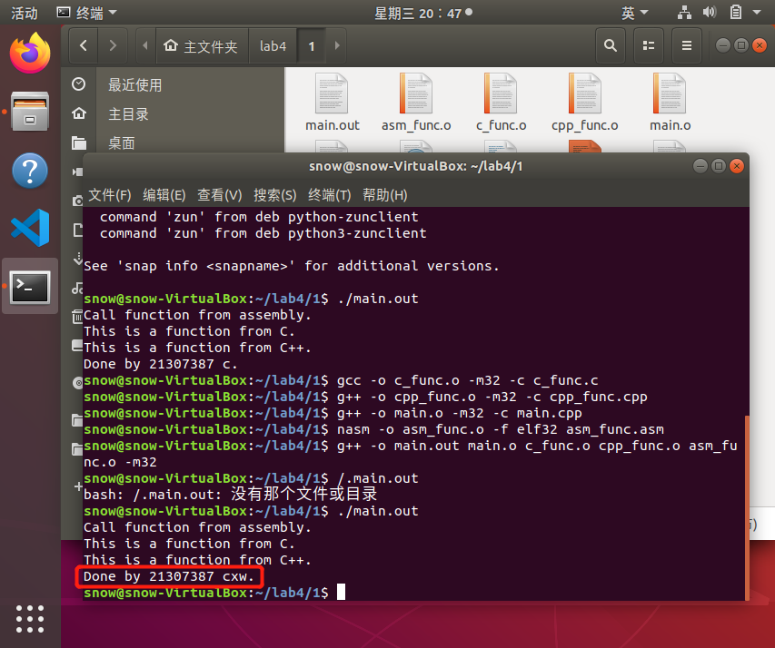
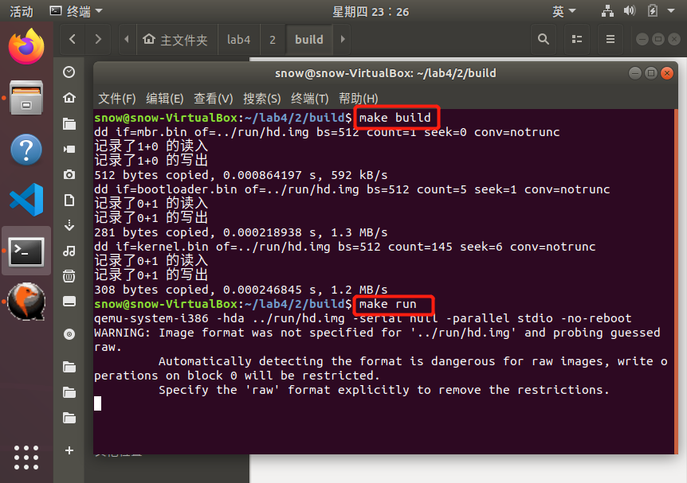
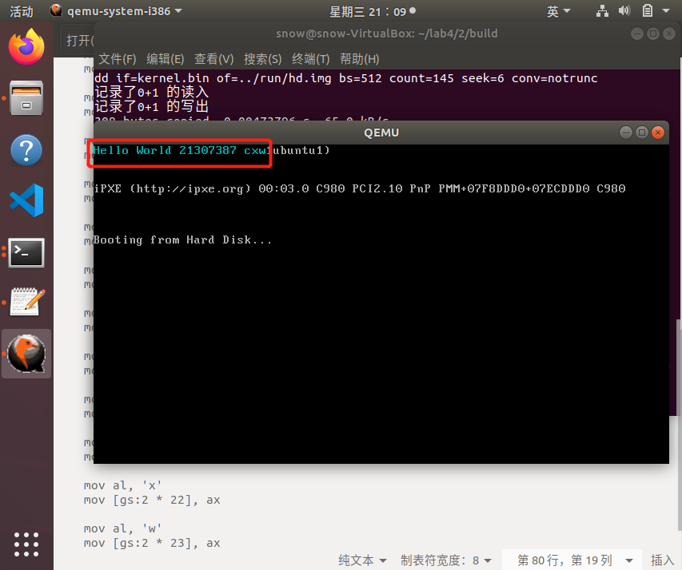
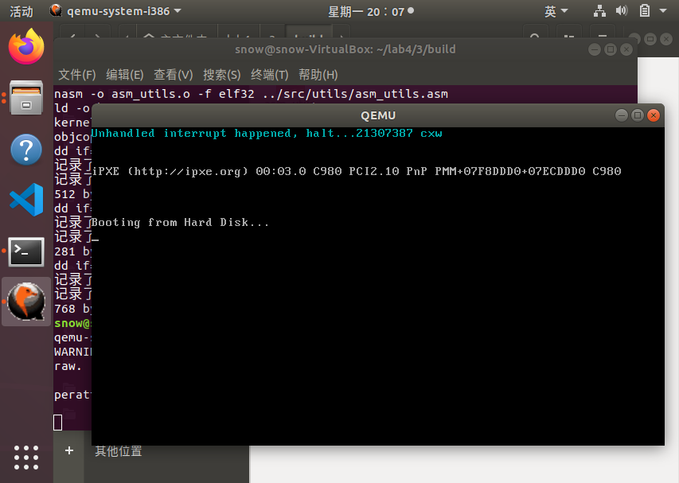
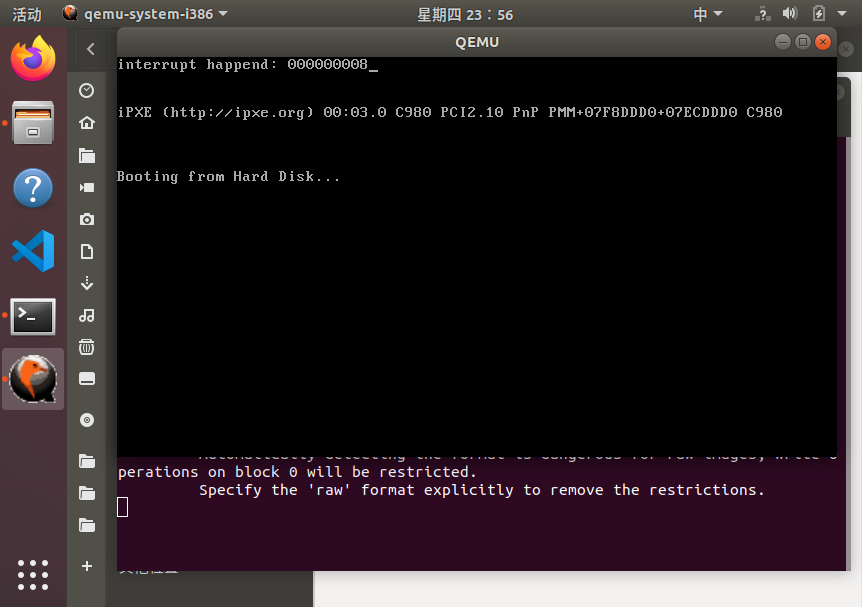
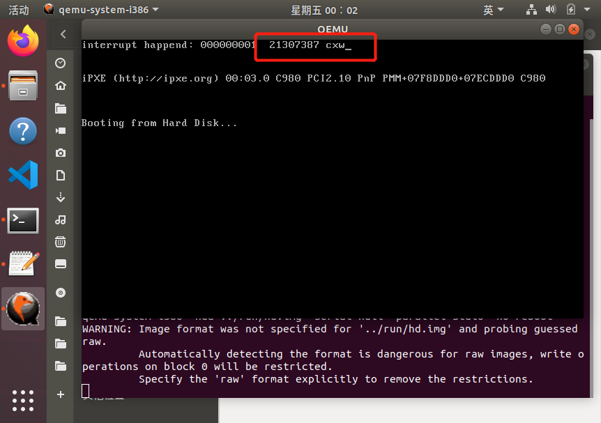

# 本科生实验报告

实验课程: 操作系统原理实验

任课教师: 刘宁

实验题目: **从实模式到保护模式**

专业名称: 计算机科学与技术

学生姓名: **陈雪玮**

学生学号: **21307387**

实验地点: 实验中心D501

实验时间: 2023.4.19

## Section 1 实验概述

* 首先，学习一份C代码是如何通过预编译、编译、汇编和链接生成最终的可执行文件。

* 接着，为了更加有条理地管理我们操作系统的代码，我们提出了一种C/C++项目管理方案。

* 在做了上面的准备工作后，我们开始介绍C和汇编混合编程方法，即如何在C代码中调用汇编代码编写的函数和如何在汇编代码中调用使用C编写的函数。

* 介绍完混合编程后，我们来到了本章的主体内容——中断。我们介绍了保护模式下的中断处理机制和可编程中断部件8259A芯片。最后，我们通过编写实时钟中断处理函数来将本章的所有内容串联起来。

通过本章的学习，同学们将掌握使用C语言来编写内核的方法，理解保护模式的中断处理机制和处理时钟中断，为后面的二级分页机制和多线程/进程打下基础。

## Section 2 预备知识与实验环境

该节总结实验需要用到的基本知识，以及主机型号、代码编译工具、重要三方库的版本号信息等。

- 预备知识：x86汇编语言程序设计、Linux系统命令行工具

- 实验环境：
  
  - 虚拟机版本/处理器型号：Ubuntu18.04、i386
  
  - 代码编辑环境：Linux
  
  - 代码编译工具：makefile、gcc等
  
  - 重要三方库信息：

## Section 3 实验任务

- 实验任务1：复现指导书中“**⼀个混合编程的例⼦**”部分。

- 实验任务2：复现指导书中“**内核的加载**”部分。

- 实验任务3：复现指导书中“**初始化IDT**”部分。

- 实验任务4：复现指导书中“**8259A编程——实时钟中断的处理**”部分。

## Section 3 实验步骤与实验结果

### ------------------------- 实验任务1 -------------------------

- 任务要求：
  
  1. 将原例⼦中最后⼀⾏的输出"Done"（参考下图）改为"`Done by 你的学号 你的姓名⾸字⺟`"；  
     
     
  
  2. 结合具体的代码说明C代码调⽤汇编函数的语法和汇编代码调⽤C函数的语法。例如，结合关键代码说明 global 、 extern 关键字的作⽤，为什么C++的函数前需要加上 extern "C" 等， 保存结果截图并说说你是怎么做的；  
  
  3. 学习make的使⽤，并⽤make来构建项⽬，保存结果截图并说说你是怎么做的。

- 思路分析：

**先创建C函数、C++函数和汇编函数。**

> - 在文件`c_func.c`中定义C函数`function_from_C`。
> - 在文件`cpp_func.cpp`中定义C++函数`function_from_CPP`。
> - 在文件`asm_func.asm`中定义汇编函数`function_from_asm`。

**然后通过汇编函数调用C和C++函数，通过C++主函数调用汇编函数。**

> * 在`function_from_asm`中调用`function_from_C`和`function_from_CPP`。
> 
> * 在文件`main.cpp`中调用汇编函数`function_from_asm`。

- 实验步骤：

**`global`**

在**汇编**中告诉编译器后续跟的是一个全局可见的名字，可能是函数名也可能是变量名。

**`extern`**

当进行**编译**时，此关键字告诉编译器它所声明的函数和变量已在其他文件中定义，可以在本模块或者文件以及其他模块或文件中使用。

**`extern "C"`**

这句话告诉编译器此语句块按 C 代码规则**编译**，不进行C++为了区别同名的函数重载在编译时进行的名字修饰。因此，如果不加`extern "C"`，那么我们在汇编代码中声明的标号就不是`function_from_CPP`，而是`function_from_CPP`经过名字修饰后的标号。

--------------------------------------------

1. 在文件`c_func.c`中定义C函数`function_from_C`，这个函数将输出`This is a function from C.``。

```c
#include <stdio.h>
void function_from_C() {
    printf("This is a function from C.\n");
}
```

2. 在文件`cpp_func.cpp`中定义C++函数`function_from_CPP`，这个函数将输出`This is a function from C++.`。其中`extern "C"`告诉编译器此语句块按照C的特性编译和链接。

```cpp
#include <iostream>
extern "C" void function_from_CPP() {
    std::cout << "This is a function from C++." << std::endl;
}
```

3. 在文件`asm_func.asm`中定义汇编函数`function_from_asm`。在`function_from_asm`中调用`function_from_C`和`function_from_CPP`。

```nasm
[bits 32]
global function_from_asm
extern function_from_C
extern function_from_CPP

function_from_asm:
    call function_from_C
    call function_from_CPP
    ret
```

4. 在文件`main.cpp`中调用汇编函数`function_from_asm`。

```cpp
#include <iostream>

extern "C" void function_from_asm();

int main() {
    std::cout << "Call function from assembly." << std::endl;
    function_from_asm();
    std::cout << "Done by 21307387 cxw." << std::endl;
}
```

5. 创建makefile文件，使用malefile将这4个文件统一编译成可重定位文件即`.o`文件，然后将这些`.o`文件链接成一个可执行文件。最后输入指令`./main.out`执行`main.out`。

```makefile
 main.out: main.o c_func.o cpp_func.o asm_func.o
 g++ -o main.out main.o c_func.o cpp_func.o asm_func.o -m32

 c_func.o: c_func.c
 gcc -o c_func.o -m32 -c c_func.c

 cpp_func.o: cpp_func.cpp
 g++ -o cpp_func.o -m32 -c cpp_func.cpp 

 main.o: main.cpp
 g++ -o main.o -m32 -c main.cpp

 asm_func.o: asm_func.asm
 nasm -o asm_func.o -f elf32 asm_func.asm
 clean:
 rm *.o
```

* 实验结果展示：通过执行前述代码，可得下图结果。

  

### ------------------------- 实验任务2 -------------------------

- 任务要求：

复现指导书中“内核的加载”部分，进⼊` setup_kernel `函数后，将输出` Hello World `改为输出**你的学号+姓名首字母**，保存结果截图并说说你是怎么做的。

- 思路分析：
1. 在bootloader中加载操作系统内核到地址0x20000，跳转到0x20000。

2. 内核接管控制权后，输出“`Hello World 21307387 cxw`”。
- 实验步骤：
1. 定义文件目录。

> - `project/build`。存放Makefile，make之后生成的中间文件如`.o`，`.bin`等会放置在这里，目的是防止这些文件混在代码文件中。
> - `project/include`。存放`.h`等函数定义和常量定义的头文件等。
> - `project/run`。存放gdb配置文件，硬盘映像`.img`文件等。
> - `project/src`。存放`.c`，`.cpp`等函数实现的文件。

```context
├── build
│   └── makefile
├── include
│   ├── asm_utils.h
│   ├── boot.inc
│   ├── os_type.h
│   └── setup.h
├── run
│   ├── gdbinit
│   └── hd.img
└── src
    ├── boot
    │   ├── bootloader.asm
    │   ├── entry.asm
    │   └── mbr.asm
    ├── kernel
    │   └── setup.cpp
    └── utils
        └── asm_utils.asm
```

2. 在bootloader的最后加上读取内核的代码，代码在`src/boot/bootloader.asm`。

```nasm
... ; 进入保护模式并初始化的代码 

mov eax, KERNEL_START_SECTOR
mov ebx, KERNEL_START_ADDRESS
mov ecx, KERNEL_SECTOR_COUNT

load_kernel: 
    push eax
    push ebx
    call asm_read_hard_disk  ; 读取硬盘
    add esp, 8
    inc eax
    add ebx, 512
    loop load_kernel

jmp dword CODE_SELECTOR:KERNEL_START_ADDRESS       ; 跳转到kernel

jmp $ ; 死循环

; asm_read_hard_disk(memory,block)
; 加载逻辑扇区号为block的扇区到内存地址memory

... ;省略
```

    在`include/boot.inc`中新增上述函数中的常量。

```nasm
; __________kernel_________
KERNEL_START_SECTOR equ 6
KERNEL_SECTOR_COUNT equ 200
KERNEL_START_ADDRESS equ 0x20000
```

2. bootloader完成，下面编写内核。首先，在`src/boot/entry.asm`下定义内核进入点。

```nasm
extern setup_kernel
enter_kernel:
    jmp setup_kernel
```

 在 `jmp` 指令执行后，将跳转到C++函数 `setup_kernel`。此后，我们便可以使用C++来写内核了。

`setup_kernel` 的定义在文件 `src/kernel/setup.cpp` 中，内容如下。

```cpp
#include "asm_utils.h"

extern "C" void setup_kernel()
{
    asm_hello_world();
    while(1) {

    }
}
```

3. 汇编函数放置在`src/utils/asm_utils.h`下，如下所示。在`Hello World`后增加输出`21307387 cxw`，代码如下：

```nasm
[bits 32]

global asm_hello_world

asm_hello_world:
    push eax
    xor eax, eax

    mov ah, 0x03 ;青色
    mov al, 'H'
    mov [gs:2 * 0], ax

    ;...省略

    mov al, 'w'
    mov [gs:2 * 23], ax

    pop eax
    ret
```

4. 然后我们统一在文件`include/asm_utils.h`中声明所有的汇编函数，这样我们就不用单独地使用`extern`来声明了，只需要`#include "asm_utils.h"`即可，如下所示。
   
   ```c
   #ifndef ASM_UTILS_H
   #define ASM_UTILS_H
   extern "C" void asm_hello_world();
   #endif
   ```

5. 在build文件夹中使用makefile编译链接和启动内核。



- 实验结果展示：通过执行前述代码，可得下图结果。



### ------------------------- 实验任务3 -------------------------

- 任务要求：

复现指导书中“初始化IDT”部分，你可以更改默认的中断处理函数为你编写的函数，然后触发之，结果截图并说说你是怎么做的。要求：**调用处理函数时输出个人特征信息。**

- 思路分析：

初始化IDT的256个中断，这256个中断的中断处理程序均是向屏幕输出`“Unhandled interrupt happened, halt...21307387 cxw”`后关中断，然后做死循环。

要完成三件事情：

> - 确定IDT的地址。
> - 定义中断默认处理函数。
> - 初始化256个中断描述符。

- 实验步骤：
1. 我们自上而下实现，先定义好整体的框架，在实验任务2的基础上完成：

定义文件目录：

```nasm
├── build
│   └── makefile
├── include
│   ├── asm_utils.h
│   ├── boot.inc
│   ├── interrupt.h
│   ├── os_constant.h
│   ├── os_modules.h
│   ├── os_type.h
│   └── setup.h
├── README.md
├── run
│   ├── gdbinit
│   └── hd.img
└── src
    ├── boot
    │   ├── bootloader.asm
    │   ├── entry.asm
    │   └── mbr.asm
    ├── kernel
    │   ├── interrupt.cpp
    │   └── setup.cpp
    └── utils
        └── asm_utils.asm
```

定义中断管理器类`InterruptManager`，位于`include/interrupt.h`，用于描述中断管理模块：

```cpp
#ifndef INTERRUPT_H
#define INTERRUPT_H

#include "os_type.h"

class InterruptManager
{
private:
    // IDT起始地址
    uint32 *IDT;

public:
    InterruptManager();
    // 初始化
    void initialize();
    // 设置中断描述符
    // index   第index个描述符，index=0, 1, ..., 255
    // address 中断处理程序的起始地址
    // DPL     中断描述符的特权级
    void setInterruptDescriptor(uint32 index, uint32 address, byte DPL);
};

#endif
```

定义基本数据类型的别名，位于`include/os_type.h`

```nasm
#ifndef OS_TYPE_H
#define OS_TYPE_H

// 类型定义
typedef unsigned char byte;
typedef unsigned char uint8;

typedef unsigned short uint16;
typedef unsigned short word;

typedef unsigned int uint32;
typedef unsigned int uint;
typedef unsigned int dword;

#endif
```

2. 确定IDT的地址。

将IDT设定在地址 0x8880 处，即 `IDT_START_ADDRESS=0x8880` 。

共256个中断描述符，每个中断描述符的大小均为8字节，因此表界限大小有：

`表界限 = 8*256-1=2047`.

因此，IDTR的32位基地址是 0x8880 ，表界限是 2047 。

3. 定义中断默认处理函数。

初始化IDT，完成函数`InterruptManager::initialize`。

```cpp
void InterruptManager::initialize()
{
    // 初始化IDT
    IDT = (uint32 *)IDT_START_ADDRESS;
    asm_lidt(IDT_START_ADDRESS, 256 * 8 - 1);

    for (uint i = 0; i < 256; ++i)
    {
        setInterruptDescriptor(i, (uint32)asm_interrupt_empty_handler, 0);
    }
}
```

将IDT的信息放入到IDTR，完成函数`asm_lidt`，代码放置在`src/utils/asm_utils.asm`。

```nasm
; void asm_lidt(uint32 start, uint16 limit)
asm_lidt:
    push ebp
    mov ebp, esp
    push eax

    mov eax, [ebp + 4 * 3]
    mov [ASM_IDTR], ax
    mov eax, [ebp + 4 * 2]
    mov [ASM_IDTR + 2], eax
    lidt [ASM_IDTR]

    pop eax
    pop ebp
    ret

ASM_IDTR dw 0
      dd 0
```

4. 初始化256个中断描述符。

将段描述符的设置定义在函数 `InterruptManager::setInterruptDescriptor` 中，这个函数将插入256个默认的中断处理描述符到IDT中，如下所示：

```cpp
// 设置中断描述符
// index   第index个描述符，index=0, 1, ..., 255
// address 中断处理程序的起始地址
// DPL     中断描述符的特权级
void InterruptManager::setInterruptDescriptor(uint32 index, uint32 address, byte DPL)
{
    IDT[index * 2] = (CODE_SELECTOR << 16) | (address & 0xffff);
    IDT[index * 2 + 1] = (address & 0xffff0000) | (0x1 << 15) | (DPL << 13) | (0xe <定义一个默认的中断处理函数是 asm_interrupt_empty_handler ，放置在 src/utils/asm_utils.asm 中，如下所示。< 8);
}
```

4. 定义一个默认的中断处理函数是 `asm_interrupt_empty_handler` ，放置在 `src/utils/asm_utils.asm` 中，我修改了默认中断处理函数输出的内容包含我的学号和名字，如下所示。

```cpp
ASM_UNHANDLED_INTERRUPT_INFO db 'Unhandled interrupt happened, halt...21307387 cxw'
                             db 0

; void asm_unhandled_interrupt()
asm_unhandled_interrupt:
    cli
    mov esi, ASM_UNHANDLED_INTERRUPT_INFO
    xor ebx, ebx
    mov ah, 0x03
.output_information:
    cmp byte[esi], 0
    je .end
    mov al, byte[esi]
    mov word[gs:bx], ax
    inc esi
    add ebx, 2
    jmp .output_information
.end:
    jmp $
```

5. 在 `InterruptManager::initialize` 最后，我们调用 `setInterruptDescriptor` 放入256个默认的中断描述符即可，这256个默认的中断描述符对应的中断处理函数是 `asm_unhandled_interrupt`。

6. 最后，我们在函数`src/kernel/setup_kernel.cpp`中定义并初始化中断处理器。注意，我们只会定义一个`InterruptManager`的实例，因为中断管理器有且只有一个。

```cpp
... // 头文件的包含

// 中断管理器
InterruptManager interruptManager;

extern "C" void setup_kernel()
{
    // 中断处理部件
    interruptManager.initialize();
    // 死循环
    asm_halt();
}
```

7. 然后我们在`include/os_modules.h`中声明这个实例，以便在其他`cpp`文件中使用。

```cpp
#ifndef OS_MODULES_H
#define OS_MODULES_H
#include "interrupt.h"
extern InterruptManager interruptManager;
#endif
```

8. 最后，我们将一些常量统一定义在文件`include/os_constant.h`下。

9. 使用make语句编译，在qemu的debug模式下加载运行，在gdb下使用`x/256gx 0x8880`命令查看我们已经放入默认的中断描述符。
- 实验结果展示：通过执行前述代码，可得下图结果。



### ------------------------- 实验任务4 -------------------------

- 任务要求：

复现指导书中“**8259A编程——实时钟中断的处理**”部分，要求：
仿照该章节中使⽤C语⾔来实现时钟中断的例⼦，利⽤ C/C++ 、 InterruptManager 、 STDIO 和你⾃⼰封装的类来实现你的时钟中断处理过程，保存结果截图并说说你的思路和做法。

注意：不可以使⽤纯汇编的⽅式来实现。

- 思路分析：

对8529A芯片进行编程，添加处理实时钟中断的函数，函数在第一行显示目前中断发生的次数。

> - 编写中断处理函数。
> - 设置主片IRQ0中断对应的中断描述符。
> - 开启时钟中断。
> - 开中断。

- 实验步骤：
1. 为中断控制器 `InterruptManager` 加入如下成员变量和函数。

```cpp
class InterruptManager
{
private:
    uint32 *IDT;              // IDT起始地址

    uint32 IRQ0_8259A_MASTER; // 主片中断起始向量号
    uint32 IRQ0_8259A_SLAVE;  // 从片中断起始向量号

public:
    InterruptManager();
    void initialize();
    // 设置中断描述符
    // index   第index个描述符，index=0, 1, ..., 255
    // address 中断处理程序的起始地址
    // DPL     中断描述符的特权级
    void setInterruptDescriptor(uint32 index, uint32 address, byte DPL);

    // 开启时钟中断
    void enableTimeInterrupt();
    // 禁止时钟中断
    void disableTimeInterrupt();
    // 设置时钟中断处理函数
    void setTimeInterrupt(void *handler);

private:
    // 初始化8259A芯片
    void initialize8259A();
};
```

2. 初始化8259A

```cpp
void InterruptManager::initialize8259A()
{
    // ICW 1
    asm_out_port(0x20, 0x11);
    asm_out_port(0xa0, 0x11);
    // ICW 2
    IRQ0_8259A_MASTER = 0x20;
    IRQ0_8259A_SLAVE = 0x28;
    asm_out_port(0x21, IRQ0_8259A_MASTER);
    asm_out_port(0xa1, IRQ0_8259A_SLAVE);
    // ICW 3
    asm_out_port(0x21, 4);
    asm_out_port(0xa1, 2);
    // ICW 4
    asm_out_port(0x21, 1);
    asm_out_port(0xa1, 1);

    // OCW 1 屏蔽主片所有中断，但主片的IRQ2需要开启
    asm_out_port(0x21, 0xfb);
    // OCW 1 屏蔽从片所有中断
    asm_out_port(0xa1, 0xff);
}
```

3. 接下来处理主片的IRQ0中断。

```cpp
#ifndef STDIO_H
#define STDIO_H

#include "os_type.h"

class STDIO
{
private:
    uint8 *screen;

public:
    STDIO();
    // 初始化函数
    void initialize();
    // 打印字符c，颜色color到位置(x,y)
    void print(uint x, uint y, uint8 c, uint8 color);
    // 打印字符c，颜色color到光标位置
    void print(uint8 c, uint8 color);
    // 打印字符c，颜色默认到光标位置
    void print(uint8 c);
    // 移动光标到一维位置
    void moveCursor(uint position);
    // 移动光标到二维位置
    void moveCursor(uint x, uint y);
    // 获取光标位置
    uint getCursor();

public:
    // 滚屏
    void rollUp();
};

#endif
```

4. 接下来定义中断处理函数 `c_time_interrupt_handler` 。

```cpp
// 中断处理函数
extern "C" void c_time_interrupt_handler()
{
    // 清空屏幕
    for (int i = 0; i < 80; ++i)
    {
        stdio.print(0, i, ' ', 0x07);
    }

    // 输出中断发生的次数
    ++times;
    char str[] = "interrupt happend: ";
    char number[10];
    int temp = times;

    // 将数字转换为字符串表示
    for(int i = 0; i < 10; ++i ) {
        if(temp) {
            number[i] = temp % 10 + '0';
        } else {
            number[i] = '0';
        }
        temp /= 10;
    }

    // 移动光标到(0,0)输出字符
    stdio.moveCursor(0);
    for(int i = 0; str[i]; ++i ) {
        stdio.print(str[i]);
    }

    // 输出中断发生的次数
    for( int i = 9; i > 0; --i ) {
        stdio.print(number[i]);
    }
}
```

    在 `src/kernel/interrupt.cpp` 中定义一个全局变量来充当计数变量。

```cpp
int times = 0;
```

5. 中断处理函数返回需要用到`iret`，C语言缺少这个语法，因此中断发生后，CPU先跳转到汇编实现的代码，保存现场后调用`call`指令跳转到C函数主体，C函数返回后用汇编代码恢复现场，最后使用`iret`返回。

        一个完整的时钟中断处理函数如下所示，代码保存在 `asm_utils.asm` 中。

```nasm
asm_time_interrupt_handler:
    pushad

    nop ; 否则断点打不上去
    ; 发送EOI消息，否则下一次中断不发生
    mov al, 0x20
    out 0x20, al
    out 0xa0, al

    call c_time_interrupt_handler

    popad
    iretad
    iret
```

        设置时钟中断的中断描述符，也就是主片IRQ0中断对应的描述符，如下所示。

```cpp
void InterruptManager::setTimeInterrupt(void *handler)
{
    setInterruptDescriptor(IRQ0_8259A_MASTER, (uint32)handler, 0);
}
```

6. 封装开启和关闭时钟中断的函数。

```cpp
void InterruptManager::enableTimeInterrupt()
{
    uint8 value;
    // 读入主片OCW
    asm_in_port(0x21, &value);
    // 开启主片时钟中断，置0开启
    value = value & 0xfe;
    asm_out_port(0x21, value);
}

void InterruptManager::disableTimeInterrupt()
{
    uint8 value;
    asm_in_port(0x21, &value);
    // 关闭时钟中断，置1关闭
    value = value | 0x01;
    asm_out_port(0x21, value);
}
```

7. 在 `setup_kernel` 中定义 `STDIO` 的实例 `stdio` ，最后初始化内核的组件，然后开启时钟中断和开中断。
   
   ```cpp
   extern "C" void setup_kernel()
   {
       // 中断处理部件
       interruptManager.initialize();
       // 屏幕IO处理部件
       stdio.initialize();
       interruptManager.enableTimeInterrupt();
       interruptManager.setTimeInterrupt((void *)asm_time_interrupt_handler);
       asm_enable_interrupt();
       asm_halt();
   }   
   ```

        在 `include/os_modules.h` 声明这个实例。

```cpp
#ifndef OS_MODULES_H
#define OS_MODULES_H

#include "interrupt.h"

extern InterruptManager interruptManager;
extern STDIO stdio;

#endif
```

        开中断指令被封装在函数`asm_enable_interrupt`中:

```cpp
; void asm_enable_interrupt()
asm_enable_interrupt:
    sti
    ret
```

    8. 使用指令`make && make run`运行代码。

9. 在中断函数中增加显示个人信息内容`21307387 cxw`。

在中断函数`c_time_interrupt_handler`末尾添加代码如下：

```cpp
// 输出个人信息
    char str1[] = "  21307387 cxw";
    for(int i = 0; str1[i]; ++i ) {
        stdio.print(str1[i]);
    }
```

- 实验结果展示：通过执行前述代码，可得下图结果。

显示中断次数。



包含个人信息。



## Section 4 实验总结与心得体会

通过对实验内容的学习，我学习到一份C代码生成可执行文件需要经过“预编译、编译、汇编、链接”四个阶段，学习到一种C/C++项目管理方案。

通过完成四个实验任务，加深了对项目管理的认识和混合编程的使用，尤其是通过8259A新编时钟中断的编写，感受到混合编程的威力，它大大增加了代码的可读性，减少了代码的复杂度，方便了项目的管理。

通过这一章的学习，我掌握了C语言编写内核的方法，通过实践加深了对中断的认识，理解了保护模式的中断处理机制和处理时钟中断。

## Section 5 对实验的改进建议和意见

## Section 6 附录：参考资料清单

[Linux的gcc和g++的区别__stark的博客-CSDN博客](https://blog.csdn.net/bit_clearoff/article/details/53965514#:~:text=%E6%80%BB%E7%BB%93%20gcc%20%E5%92%8Cg%2B%2B%E7%9A%84%20%E5%8C%BA%E5%88%AB%3A%201%E3%80%81%20gcc%20%E9%BB%98%E8%AE%A4%E5%8F%AA%E9%93%BE%E6%8E%A5C%E5%BA%93%2C%E5%B9%B6%E4%B8%8D%E4%BC%9A%E9%93%BE%E6%8E%A5C%2B%2B%E7%9A%84%E5%BA%93%2Cg%2B%2B%E9%BB%98%E8%AE%A4%E9%93%BE%E6%8E%A5C%2B%2B%E5%BA%93%E5%92%8CC%E5%BA%93%20gcc,%E4%BF%A9%E4%B8%AA%E9%83%BD%E5%8F%AF%E4%BB%A5%20%E5%90%8E%E7%BC%80%E4%B8%BA.c%E7%9A%84%EF%BC%8C%20gcc%20%E6%8A%8A%E5%AE%83%E5%BD%93%E4%BD%9C%E6%98%AFC%E7%A8%8B%E5%BA%8F%EF%BC%8C%E8%80%8Cg%2B%2B%E5%BD%93%E4%BD%9C%E6%98%AFC%2B%2B%E7%A8%8B%E5%BA%8F%EF%BC%9B%E5%90%8E%E7%BC%80%E4%B8%BA.cpp%E7%9A%84%EF%BC%8C%E4%BF%A9%E4%B8%AA%E9%83%BD%E4%BC%9A%E8%AE%A4%E4%B8%BA%E6%98%AFC%2B%2B%E7%A8%8B%E5%BA%8F%20%E7%BC%96%E8%AF%91%E9%98%B6%E6%AE%B5%20g%2B%2B%E4%BC%9A%E8%B0%83%E7%94%A8%20gcc%20%EF%BC%8C%E5%AF%B9%E4%BA%8Ec%2B%2B%E4%BB%A3%E7%A0%81%EF%BC%8C%E4%BA%8C%E8%80%85%E6%98%AF%E7%AD%89%E4%BB%B7%E7%9A%84%E3%80%82.)
